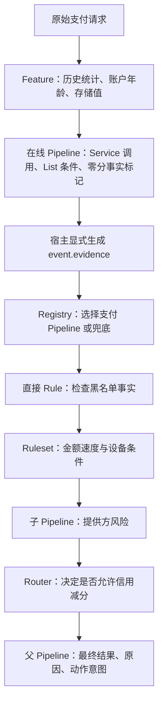

# 支付审核：一个贯穿 CDL 概念的示例

同一笔支付先取得必要事实，再完成风险计分和最终决策。所有文件都服务于这一条业务流程。
示例阈值只用于说明语言行为，金额字段 `amount_cents` 以分为单位；Schema 的 `number`
本身不要求整数。主输入使用 150000 分，最终得到 **50 分、`review`、`OPEN_REVIEW`**。

## 1. 先理解两部分如何衔接

当前 [CDL 定义](../../overall.md#language-scope)分别规定严格 Core 和在线扩展。
`import` 只能组织 Core 的 Rule、Ruleset、Pipeline；Feature、Service、List 和资源 metadata
遵循各自的扩展定义。它们没有一个可以混合装载的统一执行 profile。

本项目由宿主依次执行两个部分：

在线 Pipeline 的 `pass` 表示事实准备完成，其 `hold` 表示提供方事实不可用。
宿主仍把明确的可用性状态交给 Core；支付最终结果由 `payment_review.decision` 选择。
在线返回值不会自动写进 Core 输入，子 Pipeline 的动作也不会自动成为最终动作。

## 2. 文件与入口

| 文件 | 在流程中的作用 |
|---|---|
| [request.json](request.json) | 调用方的原始支付请求，不含预计算事实。 |
| [prepared-input.json](prepared-input.json) | 按第 4 节固定宿主数据计算得到的 Core 输入快照。 |
| [input-schema.yaml](input-schema.yaml) | 声明输入类型、嵌套对象及可选字段。 |
| [registry.yaml](registry.yaml) | Core import 入口；按事件类型选择支付策略或兜底。 |
| [pipelines/payment.yaml](pipelines/payment.yaml) | 父 Pipeline：直接 Rule、Ruleset、子 Pipeline、guard、Router 和最终决策。 |
| [pipelines/identity-review.yaml](pipelines/identity-review.yaml) | 子 Pipeline：独立局部分数、自己的 guard、局部信号和动作。 |
| [pipelines/unhandled.yaml](pipelines/unhandled.yaml) | 非支付事件的显式兜底，返回 `pass`。 |
| [rulesets/payment-risk.yaml](rulesets/payment-risk.yaml) | 按顺序调用两个 Rule，再选择首个匹配的 conclusion。 |
| [rules/blocked-email.yaml](rules/blocked-email.yaml) | 消费明确的黑名单事实，命中加 100。 |
| [rules/payment-velocity.yaml](rules/payment-velocity.yaml) | 大额与历史速度条件，命中加 50。 |
| [rules/device-pattern.yaml](rules/device-pattern.yaml) | 可选设备字段与字符串条件，命中加 25。 |
| [rules/loyalty-credit.yaml](rules/loyalty-credit.yaml) | 老客户减 20 分；仅在 Router 允许时执行。 |
| [rules/provider-risk.yaml](rules/provider-risk.yaml) | 提供方风险分达到 70 时贡献 40。 |
| [online/features.yaml](online/features.yaml) | 同一 Feature 集合中的 aggregation、state、expression、lookup。 |
| [online/customer-risk.yaml](online/customer-risk.yaml) | 一个 HTTP Service 的 assess、explain 两个 operation 及映射。 |
| [online/prepare.yaml](online/prepare.yaml) | 调用 Service，保存解释，再调用名单事实 Ruleset。 |
| [online/markers.yaml](online/markers.yaml) | 执行两个零分 Rule，以命中记录形成事实。 |
| [online/blocked-email.yaml](online/blocked-email.yaml) | `in list.blocked_emails`，展示动态名单查询。 |
| [online/loyal-customer.yaml](online/loyal-customer.yaml) | `not in`、可信客户名单与已计算的 Feature。 |

**Core 装载约定：**以本目录为显式根，入口为 `registry.yaml`，另行提供 `input-schema.yaml`。
所有 import 路径都相对此根目录。解析得到 10 个 Core 资源；`online/` 不在 import 闭包内。
Core 资源统一采用单文档形式，`version`、可选的 `import` 与资源定义同级。父子 Pipeline 共享导入
`rules/provider-risk.yaml`，该文件只装载一次；Rule 只在子 Pipeline 的显式调用处执行。

**在线装载约定：**宿主分别注册 Feature 集合、Service 和两个具名 List；加载在线两个 Rule、
Ruleset 和 Pipeline，并按 ID 绑定。这里没有 `import.features`、`import.services` 或 `import.lists`。
名单内容属于宿主数据，`list.<id>` 不创建名单。

## 3. 概念对照

| CDL 定义 | 本项目中的具体用法 |
|---|---|
| [Overall](../../overall.md) | 来源版本、资源唯一 ID、装载闭包、事实准备到最终决策的完整流程。 |
| [Import](../../import.md) | `registry.yaml` 为入口；根相对路径、分组、递归依赖、共享路径、单文档形式。 |
| [Rule](../../rule.md) | 布尔条件；命中一次贡献固定分数；正分、负分和在线零分事实标记。 |
| [Ruleset](../../ruleset.md) | `payment_risk.rules` 的有序执行、局部累加、首个匹配 conclusion 和最后 default。 |
| [Pipeline](../../pipeline.md) | 四类 step、显式 next/end、Pipeline/step guard、Router、子调用、局部结果与最终 decision。 |
| [Registry](../../registry.md) | 首个匹配入口；非支付事件走明确的 `when: "true"` 兜底。 |
| [Expression](../../expression.md) | `all/any/not`、`&&/!`、比较、除法、字面量数组、`exists`、regex/contains/starts_with/ends_with。Feature 表达式另用 `max` 与依赖。 |
| [Context](../../context.md) | Core 的 `event`、`total_score`、`results`；在线的 `features/service/vars/sys/env/llm`。 |
| [Feature](../../feature.md) | count/sum、一小时窗口、实体维度、行过滤、依赖表达式、time_since、lookup、明确 fallback。 |
| [Service](../../service.md) | 两个 operation、参数覆盖、类型保留的 JSON 模板、路径/查询编码、响应映射、超时与 fallback。 |
| [List](../../list.md) | 黑名单的 `in`、排除条件的 `not in`、可信客户名单；成功查询后的布尔组合。 |
| [Metadata](../../metadata.md) | 在线 Pipeline/Ruleset/Rule 的作者、版本、维护者与标签；描述性注解不会执行动作。Core 资源不含 metadata。 |
| [Schema](../../schema/core.json)、[Input Schema](../../schema/input.json)、[Import Header](../../schema/import-header.json) | 分别约束资源形状、事件类型及导入头；Schema 校验之后仍需引用、类型与控制流检查。 |

命名空间在在线步骤中的位置如下：

| 命名空间 | 使用位置和来源 |
|---|---|
| `event` | 调用方提供的客户、金额和币种。 |
| `features` | 在线可信客户 Rule 读取计算完成的账户年龄和信任分。 |
| `service` | `service.lookup` 保存 assess 的映射结果，供 Router 和 explain 参数读取。 |
| `vars` | 宿主提供 `vars.flow`；explain 把结果写到 `vars.review_note`。 |
| `sys` | assess 参数读取宿主提供的 `sys.request_id`。 |
| `env` | assess 参数读取宿主提供的 `env.max_score`，仅作请求说明，不改变本例计分阈值。 |
| `llm` | 宿主提供 `llm.review_note`，作为已存在的说明文字传给服务；这里没有 LLM 调用节点。 |

`sys.request_id`、`env.max_score` 和 `llm.review_note` 是本项目约定的宿主字段。
它们不是 CDL 对所有宿主承诺的固定字段，也不允许写入严格 Core 的运行时命名空间。

## 4. 固定输入事实与宿主映射

示例宿主提供以下合成数据，便于复现结果：

- `payment_history`：普通客户 `customer/001` 和可信客户 `trusted/001`，各有三笔 USD settled
  交易，金额为 60000、80000、100000 分，时间都在当前时刻前十分钟；开户时间在约 400 天前。
  其他币种、未结算、过期和未来交易不计入本例的一小时窗口。
- `customer_profiles`：两位客户的 `customer_trust_score` 都是数值 90；未找到的客户使用显式 fallback 0。
- `blocked_emails` 包含 `blocked@example.test`；`trusted_customers` 只包含 `trusted/001`。
- assess 正常响应为 `{"risk":{"score":20},"available":true,"reference":"assessment/001"}`。
  explain 正常响应含 `explanation: "Synthetic provider explanation"`。
- 宿主提供 `vars.flow: "payment-review"` 和一条固定 `llm.review_note`，不调用模型。
  Service URL 使用示意域名；执行时必须由宿主提供实际绑定。

由此计算出 count = 3、sum = 240000、average = 80000、account_age_days = 400、trust_score = 90。
原始请求中的普通客户不在可信名单中，因此没有忠诚度减分资格。

宿主进行以下明确映射，得到 [prepared-input.json](prepared-input.json)：

| Core `event.evidence` 字段 | 来源 |
|---|---|
| `blocked_email` | 在线 `email_on_blocklist` Rule 是否命中。 |
| `loyal_customer` | 在线 `loyal_customer_marker` Rule 是否命中；同时要求非黑名单、可信名单、账户年龄和信任分。 |
| `payment_count_1h` | Feature `payment_count_1h`。 |
| `average_amount_cents` | Feature `average_payment_1h`；只有非 null 的数值才写入。 |
| `provider_required` | 宿主为该次决策明确指定；主场景为 true。 |
| `provider_available`、`provider_score` | Service `service.lookup.available`、`service.lookup.score`。 |

没有历史交易时 sum 和 average 可能为 null。宿主省略可选 average 字段；Core 中的
`exists` 和短路规则避免读取它。这里没有把 null 隐式转换成 0。
在线的零分 Rule 即使命中也不加风险分；最终正负计分由 Core 策略完成。

## 5. 如何读主流程

<!-- executable-example: payment-review -->

1. 输入通过 Schema 校验；Registry 选择 `payment_review`，其 guard 要求金额大于 0。
2. `blocklisted_email` 未命中，贡献 0。风险 Ruleset 执行两条 Rule：速度条件命中加 50，
   普通设备不加分。Ruleset 返回自己的 50 分和 `review` 信号。
3. 子 Pipeline 从 0 开始。提供方分数 20 未达到 70，其 Rule 贡献 0，子 Pipeline 返回 `pass`。
   父 Pipeline 只加上子 Pipeline 返回的 0 分，不重复累加子内部 Rule。
4. Router 允许进入信用调整，但普通客户的 step guard 为 false，因此该调用被跳过。
5. 父 Pipeline 的 final decision 选择 `review`，返回 `OPEN_REVIEW` 动作意图和原因。
   宿主决定如何实际创建复核任务。

所有可读的 `results` 都对应控制流上已经到达的调用。读取可能跳过的子调用 signal 前，先判断
`status == "completed"`。分支里的 loyalty 调用不保证到达，因此最终 decision 不读取它的结果字段。

## 6. 变化场景与预期结果

下表中的修改均以第 4 节的固定数据和原始请求为基准；另有说明的除外。

| 场景 | 变化 | 最终分数 | 结果 | 动作意图 |
|---|---|---:|---|---|
| 主场景 | 无 | 50 | review | OPEN_REVIEW |
| 阈值边界 | 金额为 100000 分，比较为严格大于 | 0 | approve | 无 |
| 可信老客户 | 客户 ID 改为 trusted/001 | 30 | approve | 无 |
| 黑名单 | 邮箱改为 blocked@example.test | 100 | decline | BLOCK_PAYMENT |
| 异常设备 | device.id 改为 emulator-42 | 75 | decline | BLOCK_PAYMENT |
| 提供方高风险 | assess 的 score 改为 80 | 90 | decline | BLOCK_PAYMENT |
| 仅提供方风险 | 金额 50000 分、提供方 score 为 80 | 40 | review | OPEN_REVIEW |
| 明确不要求提供方 | 上一行基础上 provider_required 为 false | 0 | approve | 无 |
| 提供方不可用 | assess 返回完整 HTTP 503 响应，使用显式 fallback | 50 | hold | REQUEST_IDENTITY_CHECK |
| 缺少设备 | 整个可选 device 对象缺失 | 50 | review | OPEN_REVIEW |
| 无历史客户 | 客户改为 no-history，缺少 device | 0 | approve | 无 |
| 非支付事件 | type 改为 refund | 0 | pass | 无 |

黑名单命中时，后续风险 Ruleset 和子 Pipeline 的 step guard 都为 false；Router 直接结束。
提供方不可用时，子 Pipeline 的自身 guard 为 false。两种情况都不运行被跳过的资源，但原因不同。
`CHILD_REVIEW_HINT` 是子 Pipeline 的动作意图，父 Pipeline 不会自动把它放进最终动作。

以下情况保持为错误，不选择业务默认结果：

- 金额传成字符串，或者显式提供 `average_amount_cents: null`：`E_INPUT_SCHEMA`。
- 已选中支付 Pipeline，但金额为 0：`E_PIPELINE_SKIPPED`；Registry 不重新选择兜底。
- Service 连接失败、传输不完整或超时：执行错误；HTTP fallback 不兜底这些错误。
- 名单缺失、Feature 缺少数据源绑定、非法引用或 import 错误：按对应定义报错。

完整验证使用真实解析器、import 解析、编译器和执行器；数据源采用临时 SQLite、本地 HTTP 服务
及受控 Redis 协议服务。Trace 开关不改变已检查场景的分数、信号、动作和命中记录。
该示例覆盖当前定义的资源与执行概念；没有把 Sequence、Graph、旧 api 节点或模型推理等
不在当前契约内的语法当成可执行能力。
