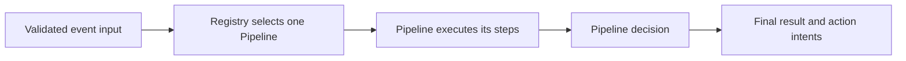

# CDL language overview

Corint Definition Language (CDL) describes conditions, scoring, routing and decisions
as declarative policy resources. This page defines common document and resource constraints
and explains how those resources work together. The linked topic references define their
fields, types and evaluation rules.

The Core flow below applies to experimental execution profile
**`cdl-core-risk-draft-1`**, language version **`"0.1"`**. Online extensions have their own
contracts, described in section 4. A language version identifies source syntax; the
selected execution profile determines which capabilities are admitted.

## Language scope

Strict Core admits Rule, Ruleset, Pipeline and Registry resources with the fields and
semantics defined in their references. It evaluates declared event inputs without external
I/O. The [import profile](import.md) adds source composition before Core validation.
[Service](service.md), [Feature](feature.md) and [List](list.md) define separately scoped
online extensions. Historical syntax and examples do not enable an undeclared capability.

## Static authoring validation

The offline `corint validate` CLI defaults to `cdl-static-1` and validates all seven
resource kinds using the [authoring schema](schema/authoring.json). A single resource
needs no Registry or input Schema. Repository mode additionally resolves references;
an optional [input Schema](schema/authoring-input.json) adds event field checks.
This authoring gate does not execute resources or change their execution profiles.

## 1. Resource roles

The four Core resource kinds have different responsibilities:

| Resource | Top-level value | Role |
|---|---|---|
| [Rule](rule.md) | `rule` object | Evaluate a Boolean condition and contribute its configured integer score when matched. |
| [Ruleset](ruleset.md) | `ruleset` object | Invoke an ordered list of Rules, accumulate a local score and choose a local signal through required `conclusion`. |
| [Pipeline](pipeline.md) | `pipeline` object | Follow `entry` and `steps`, invoke resources and choose a result through required `decision`. |
| [Registry](registry.md) | Nonempty `registry` array | Evaluate ordered entries, each with required `pipeline` and `when`, to select one entry Pipeline. |

### Document and resource constraints

These constraints apply to strict `cdl-core-risk-draft-1`, language version `"0.1"`.
Service, Feature, List and historical compatibility entry points follow their separately
declared scopes. Writing `version: "0.1"` alone does not select the strict profile or enable
capabilities that the entry point has not declared.

Each source contains one YAML document with explicit string `version: "0.1"` and exactly
one `rule`, `ruleset`, `pipeline` or `registry` resource. Unknown fields, duplicate YAML keys,
unsupported versions, missing or null required values and invalid types are rejected.
Fields are not silently ignored and versions are not automatically downgraded. The
[resource Schema](schema/core.json) uses Draft 7 JSON Schema to describe decoded YAML objects.

A complete Core collection contains exactly one Registry and every referenced resource.
Rule, Ruleset and Pipeline IDs are unique across that collection and match
`^[A-Za-z_][A-Za-z0-9_]*$`; `end` is reserved. Step IDs are unique within their Pipeline.
Any provided `name` must contain at least one non-whitespace character. Validating one
resource's structure does not validate the complete collection's references, types or
control flow; resources not selected by the Registry must also satisfy these constraints.

Resolve [authoring imports](import.md) into a complete collection before strict validation.
Execution does not discover repository resources or resolve outstanding imports. Input types
and visible values follow the [context contract](context.md#strict-core-input-and-results);
evaluation, invocation and error behavior follow the corresponding resource references.

## 2. From sources to a decision

### Authoring and resource composition

Authors can supply a complete collection directly or compose it with [imports](import.md).
Import declarations identify source files; resource references identify resource IDs.
The declared import graph is resolved before strict Core compilation. Referring to an ID
alone does not discover its source file, and importing a resource does not invoke it.

All supplied resources must pass validation, including resources that an event will not
reach. The caller also supplies an [input schema](schema/input.json) describing the event
fields available to expressions. Source resolution, input validation and policy execution
are separate operations.

### Execution

1. Validate the event against its input schema, then evaluate Registry entries in order.
   The first true condition selects one Pipeline. A final `when: "true"` entry can provide
   an explicit fallback; no match returns `E_NO_PIPELINE_MATCH`.
2. Evaluate the selected Pipeline's guard, if present. A false guard returns
   `E_PIPELINE_SKIPPED`; Registry selection does not restart.
3. Follow the Pipeline's explicit control flow. Steps can call a Rule, a Ruleset or a child
   Pipeline, or use a Router to select the next step. Guards and routes determine which
   calls execute. Their semantics are defined in [Pipeline](pipeline.md).
4. Each invocation has a local score. A Ruleset accumulates its Rule calls and selects a
   local signal. A parent Pipeline adds each direct call's returned score once, without
   adding that call's internal Rule scores again.
5. When the Pipeline reaches `end`, its `decision` selects its result and action intents.
   The selected entry Pipeline determines the final output. Child signals and actions do
   not automatically become the parent's output.

A condition error or execution error remains an error; it does not select a default
business result. Enabling execution observation does not change evaluation, short-circuiting,
scores, results or errors.

## 3. Inputs, scores and results

Core Rule and Registry conditions read declared `event.<path>` fields. Ruleset conclusions
and permitted Pipeline conditions can also read the local `total_score`; Pipeline result
reads use `results.<resource_id>` within the current invocation's allowed control-flow scope.
These results can come from direct Rule, Ruleset or child Pipeline calls. Parent and child
result scopes are isolated.

The [context contract](context.md#strict-core-input-and-results) defines which values are
available, including skipped-call status and optional input handling. The
[expression contract](expression.md) defines operators, types, precedence and short-circuiting.

Rule scores are fixed signed integers. A miss contributes zero, while a matched Rule can
contribute a positive, zero or negative score. Score ranges, overflow and invocation behavior
are defined in [Rule](rule.md#3-score-and-invocation-results).

`approve`, `decline`, `review`, `hold` and `pass` are signal values used by Ruleset conclusions
and Pipeline results. `pass` is a valid result of a completed decision. It does not skip a
call or replace the control-flow rules. In particular, a Ruleset's signal does not stop the
parent Pipeline; the parent explicitly selects its own decision.

Pipeline `actions` are returned action intents. The host decides how to carry out operations
such as blocking a request or creating a review task. A signal by itself performs neither
operation. See [Ruleset signals](ruleset.md) and [Pipeline decisions](pipeline.md).

## 4. Online extensions

Strict Core executes the supplied policy and event without external I/O. Online Service,
Feature and List capabilities belong to separately scoped contracts:

| Extension | Purpose and contract |
|---|---|
| [Service](service.md) | Explicit calls identify a logical `service` and `operation`. Results default to `service.<step_id>`; transport is provided by a runtime binding. |
| [Feature](feature.md) | Separate Feature collections describe computations and lookups. Available methods, backend constraints and how values become visible to policy evaluation follow the Feature contract. |
| [List](list.md) | Named-list membership follows the configured list's matching, type and availability semantics. |

Feature definitions and Rule definitions are separate documents. Loading a Feature collection
does not register a Rule. Reading a service result does not invoke the service.
Runtime namespaces such as `features.*`, `service.*` and `list.*` are outside Core Rule input
scope; declaring `version: "0.1"` does not enable them. The former `api` node and namespace
have been removed.

The topic references define the extension behavior. Host configuration, physical storage
and integration are outside the language definitions.

## 5. Language references and Schema

| Topic | References |
|---|---|
| Expressions and context | [Expression](expression.md), [Context](context.md) |
| Rules and scoring | [Rule](rule.md), [Ruleset](ruleset.md) |
| Control flow and results | [Pipeline](pipeline.md), [Registry](registry.md) |
| Online services and data | [Service](service.md), [Feature](feature.md), [List](list.md) |
| Source organization | [Import](import.md), [Metadata compatibility fields](metadata.md) |

Each reference declares its supported scope. Historical designs, compatibility syntax and
unverified examples do not extend the [language scope](#language-scope).

- [Resource Schema](schema/core.json): fields and structure of strict Core resources.
- [Input Schema](schema/input.json): input fields and types available to expressions.
- [Import header Schema](schema/import-header.json): authoring import declarations.

## 6. Complete language example

The [payment review project](examples/payment-review/guide.md) uses one business flow to
connect the resource definitions, expressions, context, imports and online extensions.
Its guide identifies the explicit host mapping between online facts and Core input,
with source files and expected outcomes for each part.
