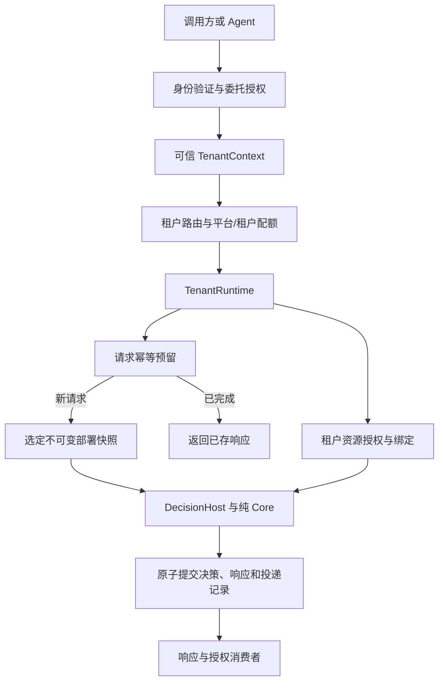

# 多租户设计复查

基线：`0af530f`，2026-09-14。基于当前源码和契约的静态架构复查；未进行多租户穿透测试或容量压测。本次只新增评审文档，没有修改业务代码。

## 判断与适用范围

当前实现是单租户实例模型。每个实例由操作员提供一套身份凭据、策略来源、信任配置、资源连接及 Journal。文档也明确声明当前本地服务不提供多租户或跨节点发布：[Core 服务边界](/Users/bmm/Workspace/corint-decision/docs/contracts/core-server.md:19)。因此，下述内容是共享部署前必须补齐的设计边界，不能据此断言当前已发生跨租户泄漏。

两种目标的改造量不同：

- **每租户独立部署**：可以保留大部分执行内核，但需建立租户管理，并隔离配置、凭据、策略仓库、信任根、Journal 和外部数据访问权限。独立容器配上能读取所有租户数据的数据库账号，仍不能形成完整数据隔离。
- **多个租户共享进程、数据库或缓存**：需要显式租户上下文、按租户管理的运行状态、资源授权、持久化命名空间及资源预算。仅增加请求里的 `tenant_id` 字段不够。

现有不可变快照、发布检查、统一 DecisionHost、可靠 Journal 和请求幂等都是可复用基础。CoreState 按 Router 实例持有状态，并非不可拆分的进程全局单例；但主程序当前只装载一套 `CORINT_CORE_CONFIG`：[入口](/Users/bmm/Workspace/corint-decision/crates/corint-decision-server/src/main.rs:76)。不必把租户判断散布到每一条规则和 AST 节点。

建议先定义清楚：`tenant` 表示客户机构的数据与权限边界，`project/workspace` 表示机构内部组织，`environment` 区分测试和生产，`deployment/scenario` 表示策略部署或业务路由。业务事件里的商户号、用户号不自动等于平台租户身份。

## 共享部署前的主要缺口

### 1. 身份模型只表达实例角色，尚不能表达租户及 Agent 的授权范围

兼容服务的 `AccessPolicy` 只有 decision、publisher 两个静态凭据和一个固定 tenant；严格 Core 也从本地配置读取角色凭据：[AccessPolicy](/Users/bmm/Workspace/corint-decision/crates/corint-decision-server/src/access.rs:6)、[CoreConfig](/Users/bmm/Workspace/corint-decision/crates/corint-decision-server/src/core.rs:46)。

现有兼容 HTTP 入口拒绝调用方提供 `event.tenant_id`，再注入操作员配置的租户，这是正确边界：[入口校验](/Users/bmm/Workspace/corint-decision/crates/corint-decision-server/src/api/rest/handlers.rs:47)。但共享服务还需要从经过验证的身份和授权关系生成不可由业务载荷覆盖的 `TenantContext`，贯穿路由、策略读取、资源访问、决策、导出及管理操作。

建议上下文至少表达 tenant、environment、principal、actor、scopes 和 request identity。Agent 代表用户执行时，应记录发起人、实际 Agent 身份和委托范围，并区分读取策略、试跑、读取特征、发布、导出私有样本等权限。不能因为 Agent 持有通用 publisher token，就允许其操作所有租户或生产环境。

### 2. 策略运行状态和仓库命名空间仍按一个部署域设计

`CoreState` 持有一个 Gate、一个 active 快照、一个 preparation 信号量及一个 Journal：[状态结构](/Users/bmm/Workspace/corint-decision/crates/corint-decision-server/src/core.rs:105)。数据库仓库读取固定 `slot='published'`：[严格仓库读取](/Users/bmm/Workspace/corint-decision/crates/corint-decision-server/src/repo_source.rs:96)。兼容 PostgreSQL 仓库按 rule id/path 读取，保存按 `ON CONFLICT(id)` 更新：[读取](/Users/bmm/Workspace/corint-decision/crates/corint-decision-repository/src/postgres.rs:136)、[保存](/Users/bmm/Workspace/corint-decision/crates/corint-decision-repository/src/postgres.rs:400)。

如果直接让 A、B 共用这些表，重名策略、发布槽和版本会冲突。应由租户注册表选择独立 TenantRuntime；其下按环境、部署管理冻结快照、发布锁及版本比较。数据库索引、外键、读写条件必须与命名空间一致。A 的 reload、撤销或回滚不得影响 B。

内容相同的纯编译产物可以按内容哈希复用，但“内容相同”不等于“有权部署到该租户”。不可把凭据、客户端、可变缓存和运行状态随编译产物一起跨租户复用。

### 3. 数据源和名单缺少由基础设施强制执行的租户范围

统一 `Query` 表达表、过滤条件、聚合和时间窗口，没有受信任的租户范围：[Query](/Users/bmm/Workspace/corint-decision/crates/corint-decision-runtime/src/datasource/query.rs:10)。特征查询加入策略条件、业务维度和可用时间截止条件，没有自动租户约束：[过滤组装](/Users/bmm/Workspace/corint-decision/crates/corint-decision-runtime/src/feature/executor.rs:525)。PostgreSQL 名单查询和删除以 `list_id + value` 为范围：[名单后端](/Users/bmm/Workspace/corint-decision/crates/corint-decision-runtime/src/lists/backend/postgresql.rs:85)。

具体风险场景：A、B 共用交易表，两边都有 `user_id=123`；若绑定的数据库账号能看到两边数据，且策略没有租户过滤，A 的次数/金额特征可能包含 B 的交易。结果可能是错误拒绝或错误放行，不只是数据显示错误。这是从查询实现推导出的共享部署风险，未声称已在现有部署复现。

建议让宿主根据 TenantContext 解析经过授权的资源句柄，绑定限定权限的连接、数据库/Schema、受限视图或行级策略。租户策略只能引用被授权资源，不能承担“每条 SQL 都记得补 tenant 条件”的责任。资源授权须覆盖读、写、名单变更、服务调用和导出；资源名称相同不构成授权。

若采用 PostgreSQL 共享表，应用层范围检查之外可用 RLS 提供数据库边界；执行账号不能拥有绕过权限，读写策略都要覆盖。表所有者通常绕过 RLS，超级用户和 BYPASSRLS 角色会绕过，唯一约束与外键检查也不受 RLS 过滤，因此仍需正确设计含租户范围的约束：[PostgreSQL 官方文档](https://www.postgresql.org/docs/current/ddl-rowsecurity.html)。共享连接池还需验证事务中的租户上下文在超时、取消和连接归还后不会残留。

### 4. Journal 的隔离依靠文件，不能直接改成共表多租户

当前 Journal 将唯一 tenant 写入元数据，并拒绝其他 tenant 复用同一数据库，这是有效的单租户保护：[归属检查](/Users/bmm/Workspace/corint-decision/crates/corint-decision-server/src/journal.rs:91)。

但 `request_keys` 的主键只有 key；outbox claim 扫描文件内待投递记录，ack 以 digest、lease 和有效期更新：[幂等表](/Users/bmm/Workspace/corint-decision/crates/corint-decision-server/src/journal.rs:185)、[领取](/Users/bmm/Workspace/corint-decision/crates/corint-decision-server/src/journal.rs:420)、[确认](/Users/bmm/Workspace/corint-decision/crates/corint-decision-server/src/journal.rs:463)。这些操作正确性的前提是整个文件只属于一个租户。

不能简单去掉 tenant 元数据检查再让多个租户混写。共享存储需要将 tenant/environment 纳入业务幂等、查询、投递、确认、容量和消费者授权的范围。建议请求身份采用 `(tenant, environment, operation, idempotency_key)`，以 fingerprint 检测相同键的不同请求；不要把策略 revision 放入幂等键，避免发布后重试重新执行。

新版本的幂等已经支持本地重启和重载；其范围明确限于同一 tenant 的同一 Journal 文件：[现有保障](/Users/bmm/Workspace/corint-decision/docs/contracts/core-operations.md:49)。同一租户部署多个副本并使用独立文件时，还需协调请求归属及持久状态，否则副本之间不能去重。此问题在横向扩容时出现，不应误写成当前没有幂等。

### 5. 缓存和资源名称尚未形成统一的隔离契约

| 位置 | 当前行为 | 共享化要求 |
| --- | --- | --- |
| 仓库缓存 | 实例内按 identifier 存储 | 复用仓库实例时须携带租户、环境和版本范围 |
| Redis 特征存储 | 可选 namespace，加 feature name 和 entity key | namespace 必须由可信资源绑定提供，不能依赖租户自行约定 |
| DataSource 查询缓存 | 客户端内按序列化 Query 生成键 | 共享客户端时明确数据授权域及资源版本，不能只看 SQL 内容 |
| Feature L1 缓存 | 当前配置入口返回 None，实际禁用 | 以后启用时应同时定义租户、特征版本、实体和时间语义 |

依据：[Redis 键](/Users/bmm/Workspace/corint-decision/crates/corint-decision-runtime/src/datasource/feature_store.rs:89)、[查询缓存键](/Users/bmm/Workspace/corint-decision/crates/corint-decision-runtime/src/datasource/client.rs:221)、[L1 禁用入口](/Users/bmm/Workspace/corint-decision/crates/corint-decision-runtime/src/feature/cache.rs:207)。严格 DecisionHost 当前要求查询缓存 TTL 为 0：[配置校验](/Users/bmm/Workspace/corint-decision/crates/corint-decision-engine/src/decision_host.rs:109)。因此不能将以上设计缺口表述为“当前线上缓存已经串租”。

缓存键不必机械添加所有字段：实例/资源域隔离已经保证的维度可以隐含，但这个保证必须写进类型和生命周期约束，不能靠调用方记忆。

### 6. 有实例级边界，缺租户级公平调度和平台总预算

DecisionHost 的特征执行分支使用 64 个并发许可，纯 Core 分支不经过该许可；后台 writer 各有 64 项和 32 MiB 待写预算：[特征执行准入](/Users/bmm/Workspace/corint-decision/crates/corint-decision-engine/src/decision_host.rs:261)、[后台写入](/Users/bmm/Workspace/corint-decision/crates/corint-decision-runtime/src/result/background.rs:10)。这些机制提供局部资源边界，尚不等于共享平台的租户配额。

把租户放进同一个执行域，会发生资源争抢；为每租户复制执行域，又可能使总连接数、内存和待写预算随租户数膨胀。需要“平台总预算 + 每租户预算”，分别控制在线决策、编译/评估、数据库查询、外部服务和导出，并制定排队、超时及拒绝行为。

还需要 TenantRuntime 的懒加载、空闲回收、热更新排空、暂停、迁移、密钥轮换及删除状态。不要复用进程级 shutdown 来停止单个租户。对强隔离或高负载租户保留独立进程/工作节点选项。

### 7. 审批、审计和运维访问也需要按租户闭环

审批 subject 绑定策略、上下文、目标和资源等哈希，没有显式 tenant/environment audience：[审批契约](/Users/bmm/Workspace/corint-decision/docs/contracts/schema/approval-evidence.json:57)。当前隔离来自各实例的操作员配置和本地信任根。迁到共享审批中心时，批准范围需要显式绑定租户、环境、部署和授权主体，防止把“批准了这份内容”解释成“批准任何租户生产使用”。共享模板应通过单独的授权和版本机制复用。

严格 Core 决策记录已包含 tenant；兼容持久化的 DecisionRecord 尚无 tenant 字段：[兼容记录](/Users/bmm/Workspace/corint-decision/crates/corint-decision-runtime/src/result/persistence.rs:61)。兼容出口若继续作为平台接口，需要统一审计归属，或明确只支持隔离实例。

`export_replay` 可导出输入证据和完整响应，应视为独立的敏感数据权限：[导出内容](/Users/bmm/Workspace/corint-decision/crates/corint-decision-server/src/journal.rs:446)。SQL 在 info 级别记录完整语句，Redis debug 日志记录键和值，日志平台本身也需脱敏与按租户授权：[SQL 日志](/Users/bmm/Workspace/corint-decision/crates/corint-decision-runtime/src/datasource/sql.rs:565)、[Redis 日志](/Users/bmm/Workspace/corint-decision/crates/corint-decision-runtime/src/datasource/feature_store.rs:108)。

指标已有有界聚合，但仍需平台层的租户用量、错误、延迟、配额拒绝和资源成本视图。避免将无限租户 ID 拼接为指标名称，当前 collector 的注册数有上限：[指标约束](/Users/bmm/Workspace/corint-decision/crates/corint-decision-runtime/src/observability/metrics.rs:74)。备份、恢复、保留、归档和删除也应按租户定义，而不是只在 API 层过滤。

Agent 的会话、记忆、检索索引及评估样本若由上层平台管理，同样要遵守这一范围；它们不是给 Core 规则求值器增加状态的理由。

## 建议的改造骨架

优先建立三个清晰边界：

1. **TenantContext**：认证层生成，在每次请求内不可更改；业务输入不能替换身份。
2. **TenantRuntime**：管理租户环境下的部署快照、发布、配额、资源和持久化域；单租户维护操作不影响其他租户。
3. **ResourceBinding**：资源句柄明确所有者/共享授权、环境、类型、版本和允许操作；宿主解析连接与凭据，CDL 引用授权后的资源。

建议先实现“共享管理面 + 按租户隔离的执行和资源域”，把创建、发布、观测、暂停及回收做完整。之后再把适合的小租户放入同一 worker，并按实际压力选择共享存储/缓存。隔离策略可以混合，不必对所有租户采用同一种部署方式；这一原则也与 [AWS SaaS Lens 的租户隔离说明](https://docs.aws.amazon.com/wellarchitected/latest/saas-lens/tenant-isolation.html)一致。具体先后顺序是依据本仓库现状提出的建议。

## 上线前应补的验证

以下是建议新增的验证，不代表本次已经执行：

1. A、B 使用相同 user_id、rule_id、list_id、feature name 和幂等键，数据、策略、决策及幂等结果互不影响。
2. A 的身份请求 B 的策略、资源、发布接口、决策记录和导出，即使知道真实 ID 也应拒绝。
3. A 发布、回滚、撤销或暂停时，B 的快照、吞吐和记录归属保持正确。
4. 连接取消、超时、池复用、缓存命中和凭据轮换后，不残留上一个租户的上下文。
5. A 连续运行高成本特征、批量评估或导出时，B 的在线决策仍满足约定的资源预算和延迟目标。
6. 同一租户请求跨副本重试时，幂等仍成立；不同租户同键互不冲突。
7. 租户备份、恢复、归档及导出仅覆盖授权范围，审计能还原发起人、Agent、部署版本和资源绑定。
8. 共享模板/资源只按显式授权被使用；获得试跑或模板读取权限不意味着获得生产发布权限。
